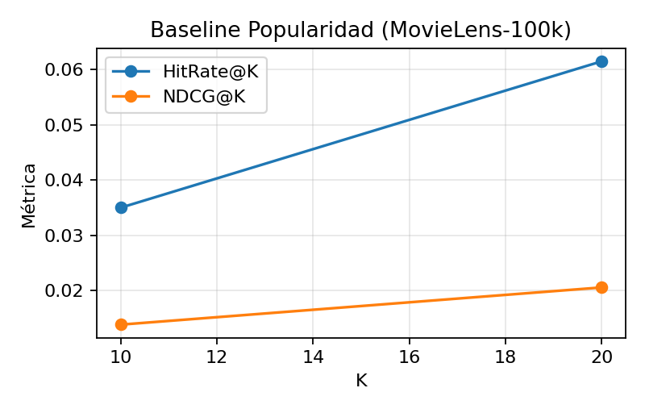

# Recommender Systems — Baselines, Theory & Reproducibility

Learn-by-building journey through **core recommender system baselines** on the classic **MovieLens-100k** dataset. The repo focuses on *clarity, correct evaluation,* and *reproducibility* so you can reason about what works, why it works, and how to extend it.

> TL;DR: We implement and evaluate **Popularity** (incl. Bayesian smoothing), **KNN User–User/Item–Item**, and **SVD** under a **Leave-One-Out** protocol with **ranking metrics** (HitRate\@K, NDCG\@K). Figures and scripts are provided to reproduce results quickly.

---

## Why this repo?

Most “intro to recsys” repos mix rating prediction (RMSE/MAE) with ranking tasks. In real products, we care about **ranking** the next items a user will see/click, not about predicting a numeric rating. This repo is:

* **Evaluation-first:** We use **Leave-One-Out per user** and **top-K** metrics (HitRate, NDCG), which better reflect real user experience.
* **Baselines that matter:** Strong, interpretable baselines you can *trust and beat* (Popularity, KNN, SVD).
* **Reproducible:** Minimal scripts, clean notebook flow, saved figures, and dataset instructions.

---

## Dataset: MovieLens-100k (explicit feedback)

* **100,000 ratings** (1–5) from **943 users** on **1,682 movies**
* Files used:

  * `u.data`: `user_id, item_id, rating, timestamp`
  * `u.item`: movie metadata (title, year, genres)
  * (others like `u.user`, `u.genre` are optional)
* **Sparsity:** \~6–7% — most user–item pairs are unobserved → this is a sparse problem.

**Why MovieLens-100k?**
It’s small enough to iterate fast and standard enough to compare results and methods fairly.

---

## Methodology & theory (concise)

### Task: next-item ranking

Given a user’s history, rank unseen items so that relevant ones appear **high** in the top-K list.

### Split: **Leave-One-Out (LOO) per user**

* Sort each user’s interactions by timestamp.
* **Test** = the user’s **last** interaction; **Train** = all previous.
* Why? It simulates “did we surface what the user consumed next?” and avoids leakage.

### Metrics: **ranking > rating**

* **HitRate\@K**: 1 if the held-out item is in top-K; else 0. (A simple, strong signal.)
* **NDCG\@K**: gives higher credit to catching the true item **near the top** of the list.
* (RMSE/MAE are great for rating prediction, but less informative for ranking UX.)

---

## Models

### 1) Popularity (with optional Bayesian smoothing)

* Global ranking shared by everyone, filtered by “already seen”.
* Baseline definition (explicit ratings): **relevant** if `rating ≥ 4`.
* **Bayesian smoothing** reduces the bias toward items with few high ratings:

$$
\hat{\mu}_i=\frac{n_i\cdot \bar r_i + m\cdot \mu}{n_i+m}
$$

where $\bar r_i$ = item mean, $n_i$ = #ratings, $\mu$ = global mean, $m$ = prior strength.

**Why it matters:** Surprisingly competitive for cold-start users and a fair reference point.

### 2) KNN Collaborative Filtering

* **User–User**: users with similar histories will like similar items.
* **Item–Item**: items co-consumed by many users are similar; recommend neighbors of items the user liked.
* Similarities: cosine, Pearson, Pearson-baseline; shrinkage for robustness.

**Why it matters:** Interpretable, strong baselines, widely deployed historically.

### 3) Matrix Factorization (SVD)

* Learn low-dimensional embeddings for users/items:

$$
\hat r_{ui} = \mu + b_u + b_i + p_u^\top q_i
$$

* Simple, powerful latent structure baseline; strong on explicit feedback.

---

## Quickstart

> **Apple Silicon (M-series) note:** Everything below works on macOS/ARM. For FAISS later, prefer conda (`faiss-cpu` via conda-forge).

### Option A — Conda (recommended)

```bash
# Create and activate environment
conda create -n recsys-env python=3.11 -y
conda activate recsys-env

# Install deps
pip install --upgrade pip
pip install -r requirements.txt
```

### Option B — venv

```bash
python3 -m venv .venv
source .venv/bin/activate   # Windows: .venv\Scripts\activate
pip install --upgrade pip
pip install -r requirements.txt
```

### Download dataset

```bash
mkdir -p data
curl -L https://files.grouplens.org/datasets/movielens/ml-100k.zip -o data/ml-100k.zip
unzip -o data/ml-100k.zip -d data
```

---

## Project structure

```
.
├─ data/
│  └─ ml-100k/                 # raw dataset (not tracked in git)
├─ notebooks/
│  ├─ 00_exploration.ipynb     # EDA (users/items counts, sparsity, histograms)
│  ├─ 10_split_loo.ipynb       # Leave-One-Out per user (train/test artifacts)
│  ├─ 20_popularity.ipynb      # Popularity baseline + Bayes smoothing
│  ├─ 30_cf_knn.ipynb          # User-User & Item-Item (Surprise)
│  ├─ 40_svd.ipynb             # Matrix Factorization (SVD)
│  └─ 50_eval_viz.ipynb        # Aggregated metrics & plots
├─ src/
│  ├─ data_utils.py            # loaders, split helpers
│  ├─ metrics.py               # HitRate@K, NDCG@K
│  ├─ popularity.py            # popularity/bayesian scores
│  ├─ knn_cf.py                # KNN recommenders
│  └─ svd.py                   # SVD wrapper
├─ reports/
│  ├─ figures/
│  │  └─ popularity_metrics.png
│  └─ metrics_popularity.csv
├─ scripts/
│  ├─ download_data.py
│  └─ train_baseline.py        # optional CLI runner
├─ tests/
│  └─ test_basic.py
├─ configs/
│  └─ default.yaml
├─ requirements.txt
└─ README.md
```

> Keep `data/` and `models/` **out of git** (see `.gitignore`). This keeps the repo lightweight and shareable.

---

## Reproduce baseline results

1. **Exploration & Split**

* Run `notebooks/00_exploration.ipynb` for a quick EDA.
* Run `notebooks/10_split_loo.ipynb` to produce `data/train.csv` and `data/test.csv` (per-user LOO).

2. **Popularity baseline**

* Run `notebooks/20_popularity.ipynb`. It will:

  * Build a global ranking from `train.csv` (rating ≥ 4 as “relevant”).
  * Recommend top-K excluding items already seen in train.
  * Evaluate with **HitRate\@K** and **NDCG\@K** on the per-user held-out item.
  * Save:

    * `reports/figures/popularity_metrics.png`
    * `reports/metrics_popularity.csv`

3. **(Next) KNN & SVD**

* `notebooks/30_cf_knn.ipynb`: Item–Item and User–User with `scikit-surprise`.
* `notebooks/40_svd.ipynb`: Matrix Factorization baseline.
* `notebooks/50_eval_viz.ipynb`: comparative bar charts across models.

---

## Results (baseline illustration)

> Replace with your actual numbers after running the notebook.

| Model                 |  K | HitRate |  NDCG |
| --------------------- | -: | ------: | ----: |
| Popularity            | 10 |  0.23xx | 0.10x |
| Popularity (Bayesian) | 10 |  0.24xx | 0.11x |

<p align="center">
  
</p>

**How to read this:**

* **HitRate\@10 = 0.23** → in \~23% of users, the “next” movie appears in their top-10.
* **NDCG\@10** rewards catching the true item higher in the list (position-sensitive).

---

## Design choices & their rationale

* **Leave-One-Out per user:** mimics “what did the user consume next?”; avoids using the future to predict the future.
* **Ranking metrics (HitRate, NDCG):** reflect actual recommender UX; rating RMSE can be misleading for top-K quality.
* **Popularity as a first step:** strong, interpretable baseline; if you can’t beat it, your personalization isn’t working yet.
* **Bayesian smoothing:** prevents overrating items with few (lucky) high scores; more robust global ranking.
* **KNN Item–Item before User–User:** item similarities are often stabler when catalogs are large; widely used in production as a solid baseline.
* **SVD:** compact latent factors capture global structure; a classic explicit-feedback baseline to compare against KNN.

---

## Roadmap

* [ ] Add **User–User** and **Item–Item** KNN (cosine, Pearson, shrinkage).
* [ ] Add **SVD** (and NMF) with ranking-aware evaluation.
* [ ] Ablations: different K values, popularity thresholding, smoothing $m$.
* [ ] Cold-start analyses (new users/items).
* [ ] Optional: serve a **Streamlit demo** that shows per-user top-K.

---

## Requirements

* Python 3.11+
* `pandas`, `numpy`, `scikit-learn`, `matplotlib`, `seaborn`
* `scikit-surprise` (KNN, SVD)
* `jupyter` (notebooks)

> Apple Silicon tip: if you later add FAISS, prefer `conda install -c conda-forge faiss-cpu` on ARM.

---

## License

MIT — use freely with attribution.

---

**Questions or ideas?** Open an issue or ping me. If you’re exploring recommenders for e-commerce/media and want a quick prototype or an audit of your current pipeline, I’m happy to help.
